# Image index

All photography is real SAVVA content, pulled from [@savva_cafe](https://www.instagram.com/savva_cafe) on Instagram and processed by `scripts/optimize-images.py` into `public/img/`. This file embeds every photo actually shipped on the site, grouped by where it appears.

- **Source**: `assets/raw/ig_<code>.jpg` — one original frame per Instagram post.
- **Output**: `public/img/<slug>-{480,960,1600}.webp` — cropped/resized per slot. Regenerate with `python scripts/optimize-images.py` after editing the `SLOTS` dict there.
- **Slug** is what the site code references (`src/js/data.js#imgSrcset`, `src/data/menu.json#slot`).

## Hero

<table>
<tr>
<td align="center">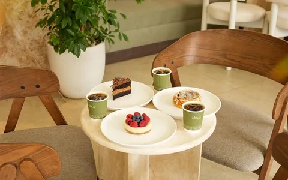 <code>hero-interior</code> Hero background</td>
<td align="center">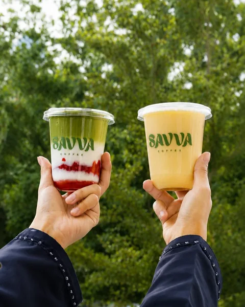 <code>hero-portrait</code> Hero badge overlay</td>
</tr>
</table>

## "A day in SAVVA" story panels

Each panel has a portrait crop for mobile and a wide crop for desktop (`<picture><source media>` swap at 761px).

<table>
<tr>
<td align="center">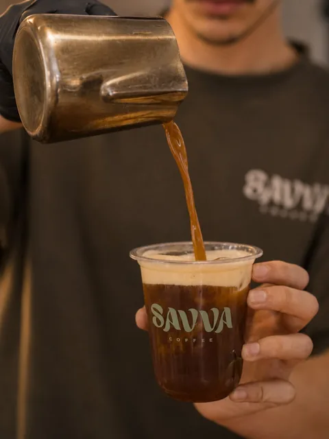 <code>story-morning</code></td>
<td align="center">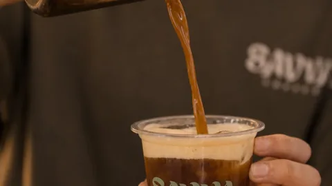 <code>story-morning-wide</code></td>
<td align="center"><b>Morning</b> "Pick your beans"</td>
</tr>
<tr>
<td align="center">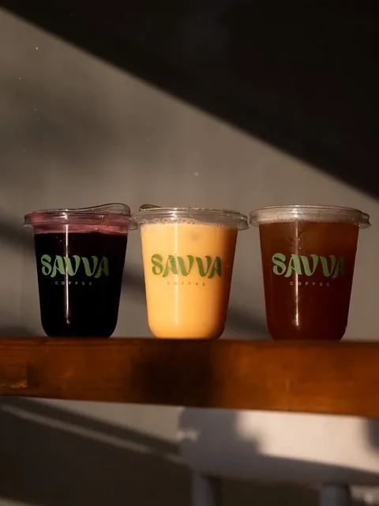 <code>story-noon</code></td>
<td align="center">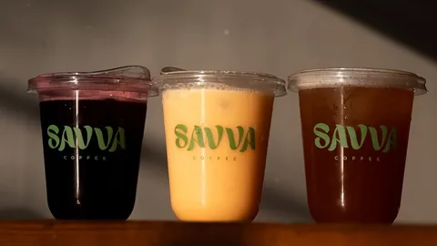 <code>story-noon-wide</code></td>
<td align="center"><b>Noon</b> "Cool off"</td>
</tr>
<tr>
<td align="center">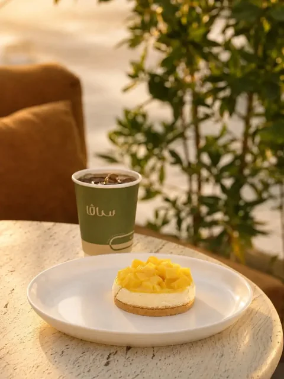 <code>story-afternoon</code></td>
<td align="center"> <code>story-afternoon-wide</code></td>
<td align="center"><b>Afternoon</b> "Something sweet"</td>
</tr>
<tr>
<td align="center">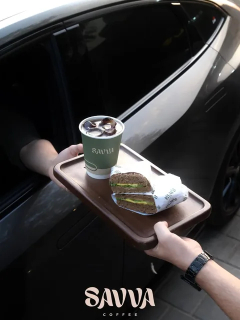 <code>story-night</code></td>
<td align="center">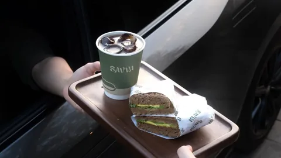 <code>story-night-wide</code></td>
<td align="center"><b>Night</b> "Drive through, till 2 AM"</td>
</tr>
</table>

## Bestsellers bento / menu item photos

Referenced by `slot` in `src/data/menu.json`. The home-page bestsellers bento reuses the same source photo as the matching menu item (separate `best-*` slug, cropped independently).

<table>
<tr>
<td align="center">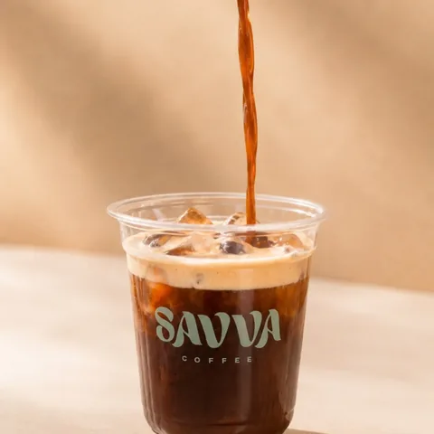 <code>cappuccino</code> / <code>best-cappuccino</code> Cappuccino</td>
<td align="center">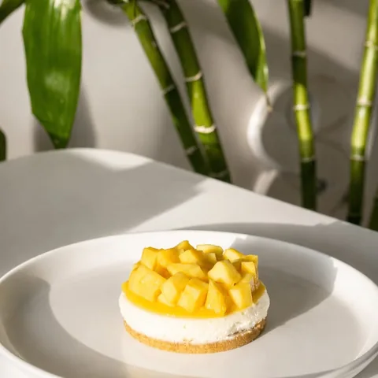 <code>cheesecake</code> / <code>best-cheesecake</code> Blueberry Cheesecake</td>
<td align="center">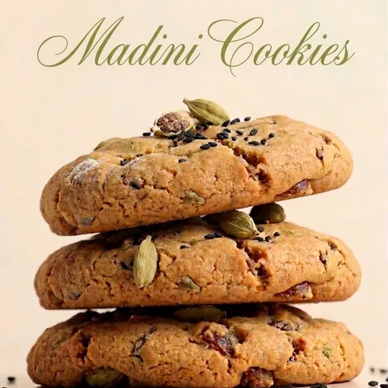 <code>cookies</code> / <code>best-cookies</code> Madini Cookies</td>
</tr>
<tr>
<td align="center">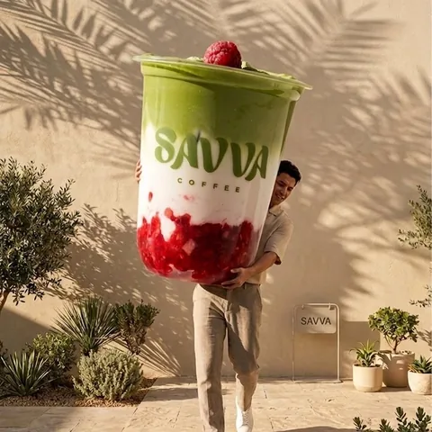 <code>matcha-berry</code> / <code>best-matcha-berry</code> Matcha Berry</td>
<td align="center">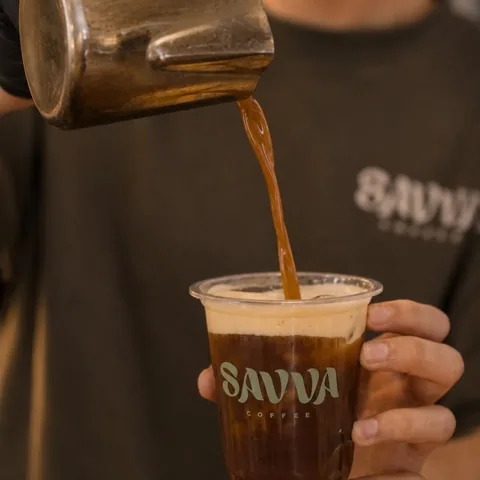 <code>pourover</code> / <code>best-coffee-of-day</code> Coffee of the Day, Drip Coffee</td>
<td align="center">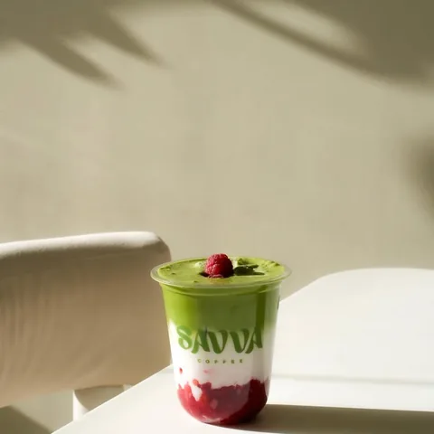 <code>matcha-1</code> Matcha Latte, Iced Matcha (Latte/Spanish), Savva Matcha</td>
</tr>
<tr>
<td align="center">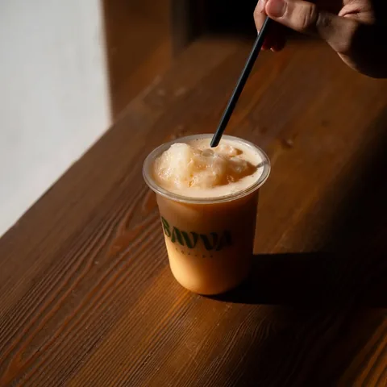 <code>coffee-cup-1</code> Espresso, Macchiato, Spanish Latte, English Tea</td>
<td align="center">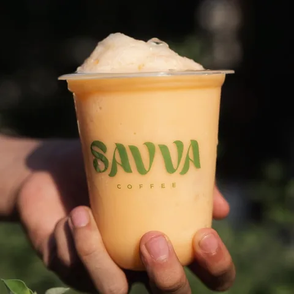 <code>coffee-cup-2</code> Americano, Flat White, White Mocha, Turkish Coffee</td>
<td align="center">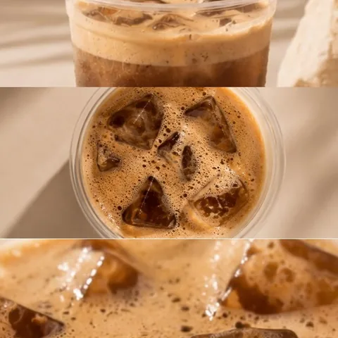 <code>coffee-cup-3</code> Cortado, Latte, Hot Chocolate, Turkish Coffee with Milk</td>
</tr>
<tr>
<td align="center">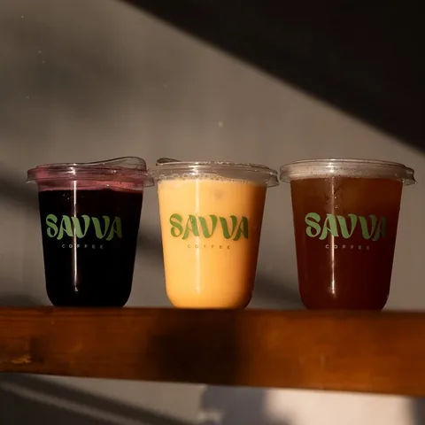 <code>iced-trio</code> All other iced drinks (Americano, Alfredo, Latte, Spanish Latte, Tea/Hibiscus Savva, Hibiscus Slush, Shaken, White Mocha, Chocolate, Savva Melon)</td>
<td align="center">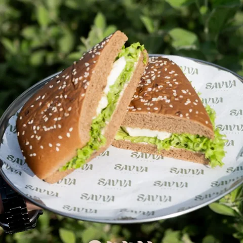 <code>sandwich</code> Turkey Sandwich, Halloumi Sandwich</td>
<td align="center">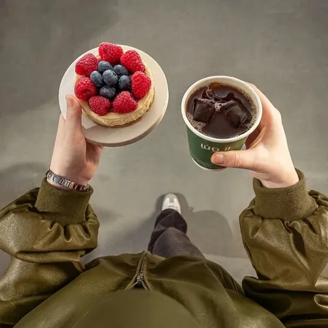 <code>dessert-tarts</code> Cinnamon Danish</td>
</tr>
<tr>
<td align="center">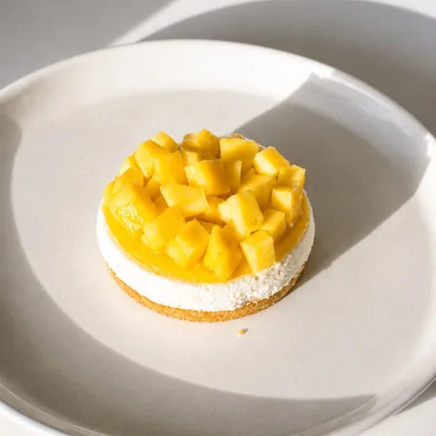 <code>dessert-mango-1</code> Marble Cake</td>
<td align="center">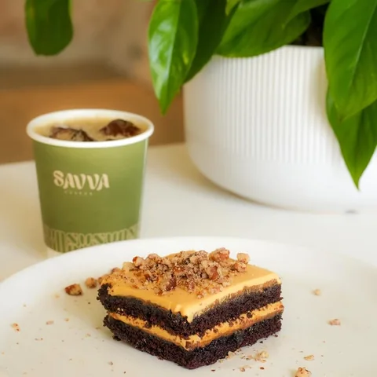 <code>dessert-mango-2</code> Pecan Cake</td>
<td align="center">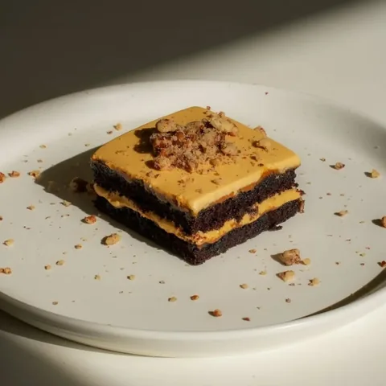 <code>dessert-choc-bars</code> Crunchy Chocolate</td>
</tr>
<tr>
<td align="center">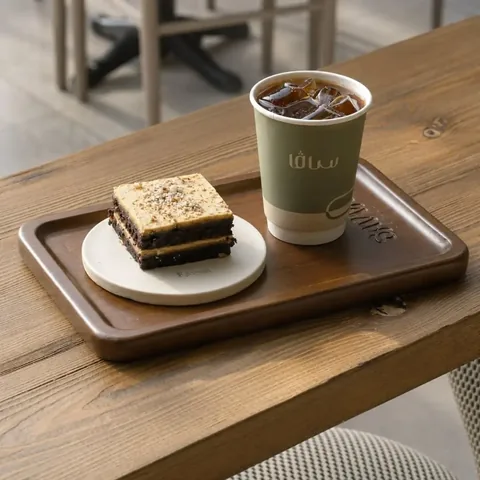 <code>dessert-choc-tray</code> Chocolate Cake</td>
<td></td>
<td></td>
</tr>
</table>

## Instagram strip (home page footer band)

<table>
<tr>
<td align="center">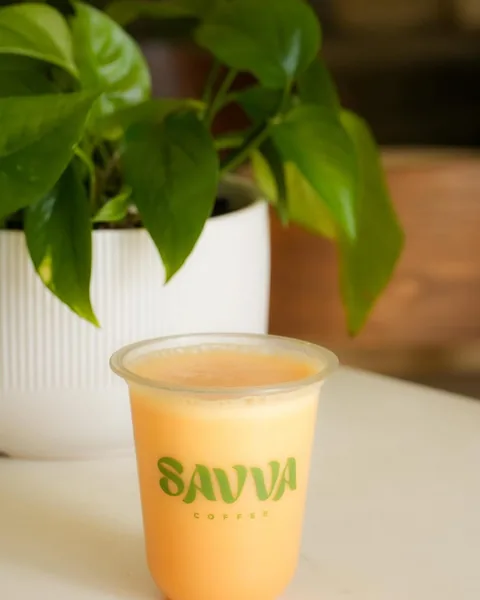 <code>ig-1</code></td>
<td align="center">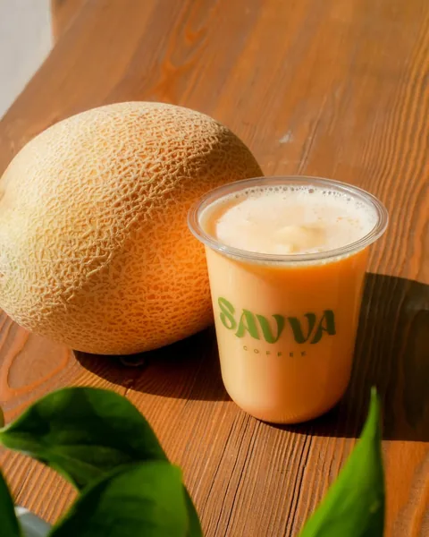 <code>ig-2</code></td>
<td align="center">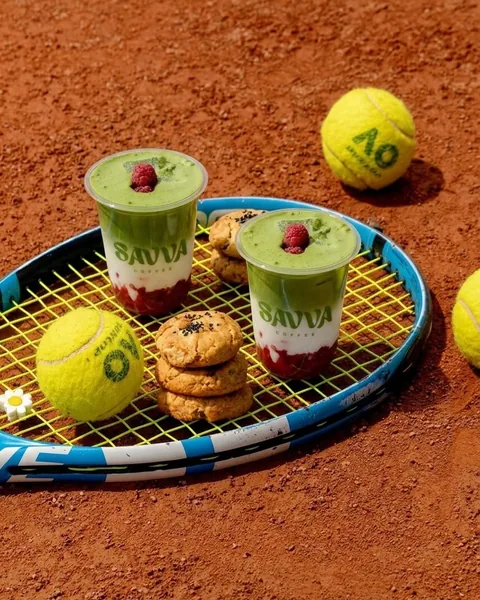 <code>ig-3</code></td>
<td align="center">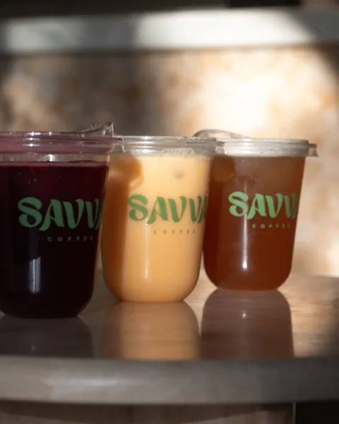 <code>ig-4</code></td>
<td align="center">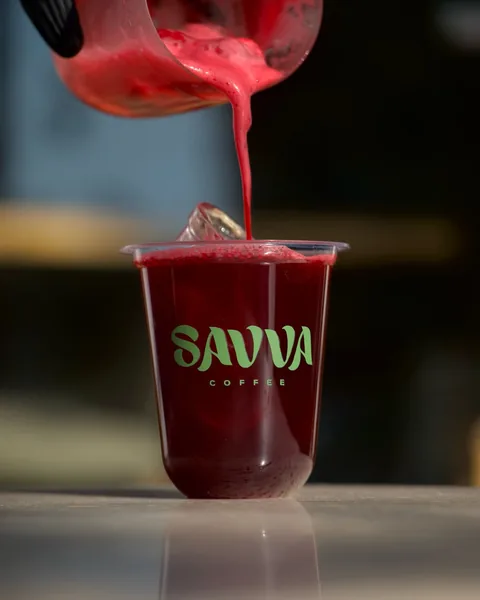 <code>ig-5</code></td>
<td align="center">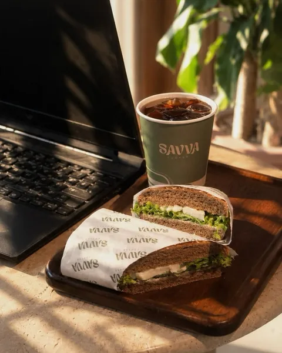 <code>ig-6</code></td>
</tr>
</table>

## Source → slug lookup

| Slug | Instagram post |
|---|---|
| `hero-interior` | [DYr0ET1jHjk](https://www.instagram.com/p/DYr0ET1jHjk/) |
| `hero-portrait` | [Db31GeksuBw](https://www.instagram.com/p/Db31GeksuBw/) |
| `story-morning` / `-wide` | [Dcbp8DSM81h](https://www.instagram.com/p/Dcbp8DSM81h/) |
| `story-noon` / `-wide` | [Dc34TRAsAtF](https://www.instagram.com/p/Dc34TRAsAtF/) |
| `story-afternoon` / `-wide` | [DceRSuxMQNX](https://www.instagram.com/p/DceRSuxMQNX/) |
| `story-night` / `-wide` | [Dc8_ifwsihu](https://www.instagram.com/p/Dc8_ifwsihu/) |
| `cappuccino` / `best-cappuccino` | [DcbmHnRs3EE](https://www.instagram.com/p/DcbmHnRs3EE/) |
| `cheesecake` / `best-cheesecake` | [Db82ltlMHMa](https://www.instagram.com/p/Db82ltlMHMa/) |
| `cookies` / `best-cookies` | [DYNTFLdsHS1](https://www.instagram.com/p/DYNTFLdsHS1/) |
| `matcha-berry` / `best-matcha-berry` | [DX9ThrBsx5G](https://www.instagram.com/p/DX9ThrBsx5G/) |
| `pourover` / `best-coffee-of-day` | [Dcbp8DSM81h](https://www.instagram.com/p/Dcbp8DSM81h/) |
| `coffee-cup-1` | [Dc1NRBAsmx2](https://www.instagram.com/p/Dc1NRBAsmx2/) |
| `coffee-cup-2` | [Dc1OkdyMeMj](https://www.instagram.com/p/Dc1OkdyMeMj/) |
| `coffee-cup-3` | [DcblgZ0MbzR](https://www.instagram.com/p/DcblgZ0MbzR/) |
| `matcha-1` | [DYHrd3JDEXG](https://www.instagram.com/p/DYHrd3JDEXG/) |
| `iced-trio` | [Dc34TRAsAtF](https://www.instagram.com/p/Dc34TRAsAtF/) |
| `sandwich` | [Dc6pEniMBhh](https://www.instagram.com/p/Dc6pEniMBhh/) |
| `dessert-tarts` | [DYuWmqbDIRg](https://www.instagram.com/p/DYuWmqbDIRg/) |
| `dessert-mango-1` | [Db_kfNrs3Xg](https://www.instagram.com/p/Db_kfNrs3Xg/) |
| `dessert-mango-2` | [DacDpiGsP7X](https://www.instagram.com/p/DacDpiGsP7X/) |
| `dessert-choc-bars` | [Dbq1RIDMcbS](https://www.instagram.com/p/Dbq1RIDMcbS/) |
| `dessert-choc-tray` | [Db1MA7CMRSX](https://www.instagram.com/p/Db1MA7CMRSX/) |
| `ig-1` | [DaVByiDMyX4](https://www.instagram.com/p/DaVByiDMyX4/) |
| `ig-2` | [DaLmsizMIjK](https://www.instagram.com/p/DaLmsizMIjK/) |
| `ig-3` | [DZNQtJzjN7y](https://www.instagram.com/p/DZNQtJzjN7y/) |
| `ig-4` | [Dc37CqYsmCr](https://www.instagram.com/p/Dc37CqYsmCr/) |
| `ig-5` | [DdHV3QCsEbd](https://www.instagram.com/p/DdHV3QCsEbd/) |
| `ig-6` | [Dc_kJc2MzdV](https://www.instagram.com/p/Dc_kJc2MzdV/) |

## Downloaded but not used (spares in `assets/raw/`)

Not referenced by any slug — `optimize-images.py` skips them. Kept in case a slot needs re-cropping later.

<table>
<tr>
<td align="center">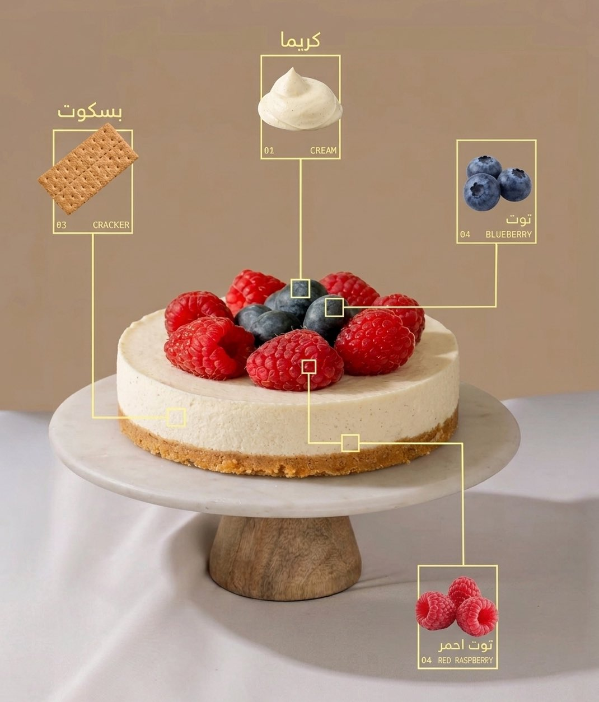 Annotated infographic, not a clean photo</td>
<td align="center">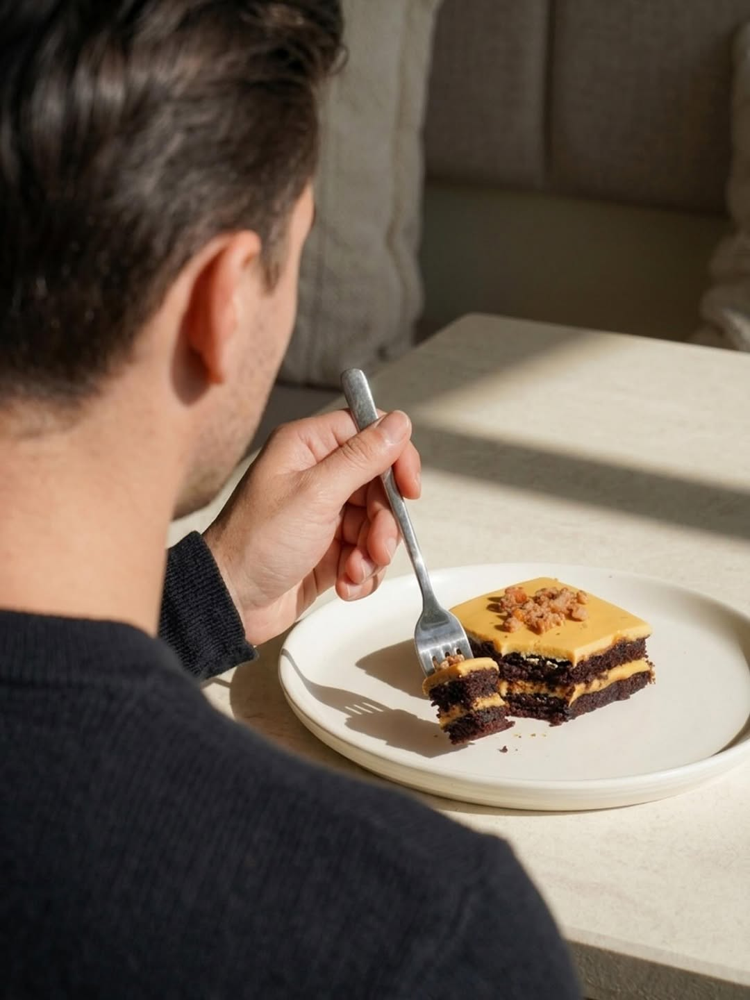 Customer's face is the subject</td>
<td align="center">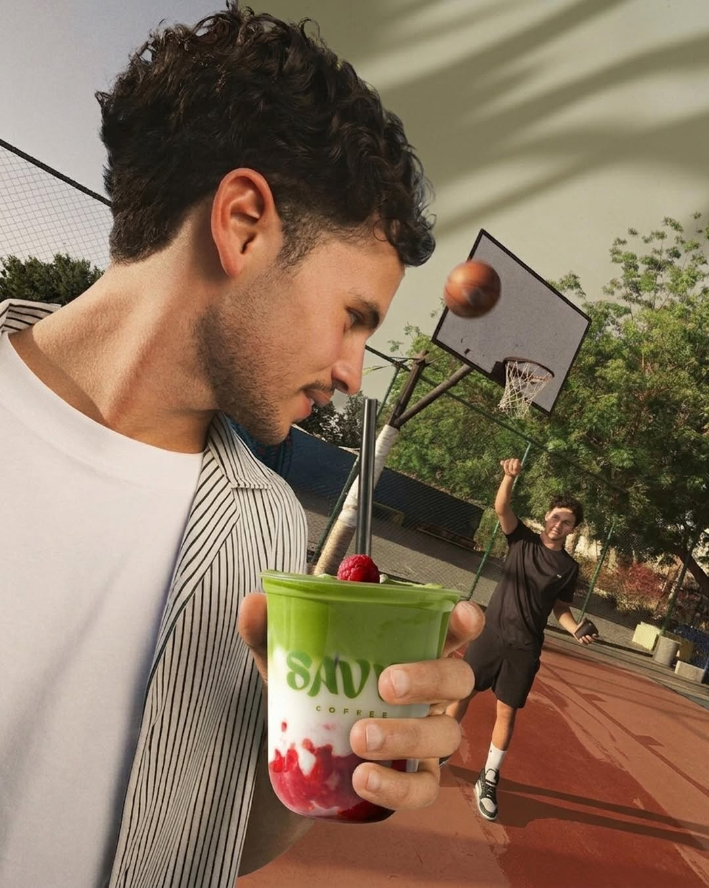 Customer's face is the subject</td>
<td align="center">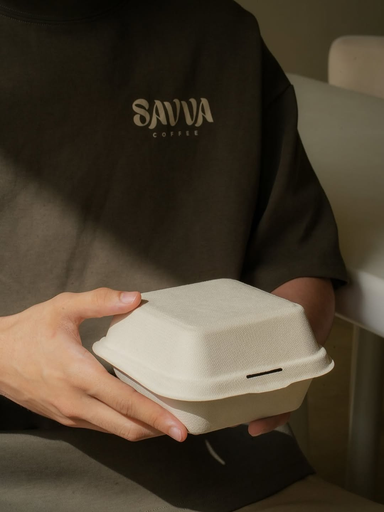 Matcha berry alt angle</td>
</tr>
<tr>
<td align="center">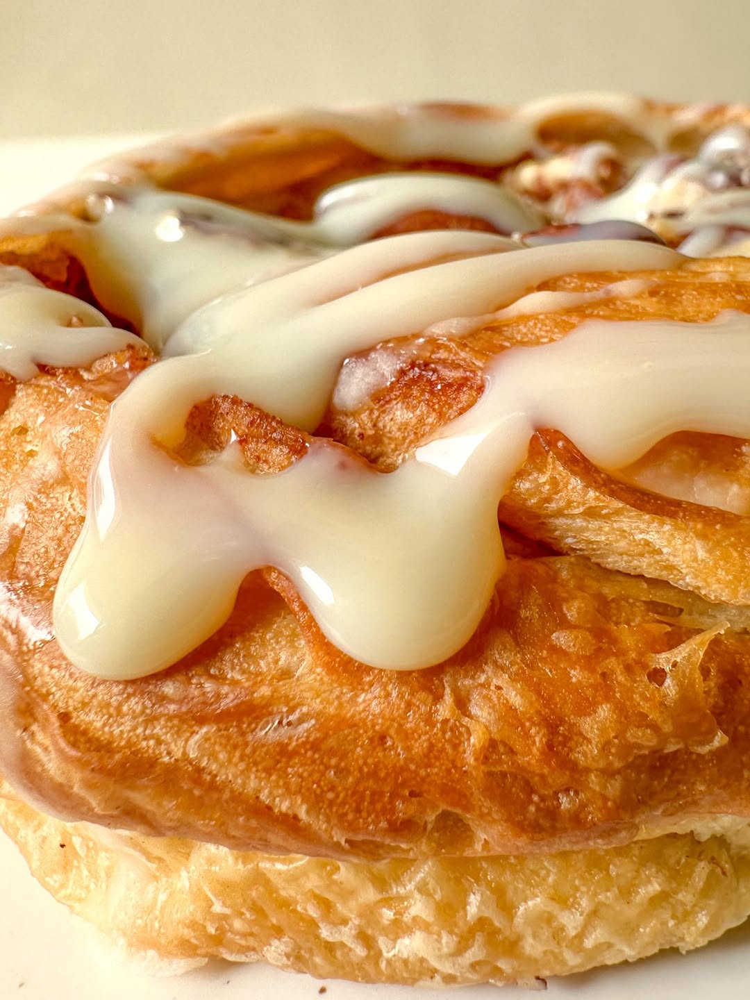 Matcha pour close-up, unused</td>
<td align="center">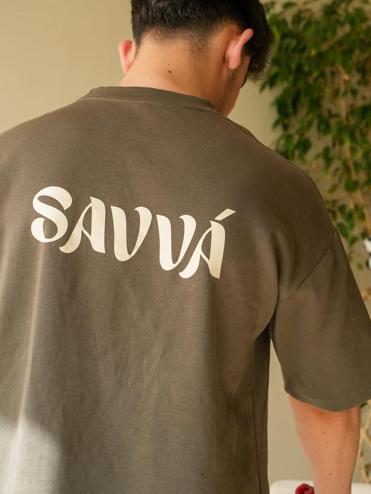 Lifestyle shot, no product</td>
<td align="center">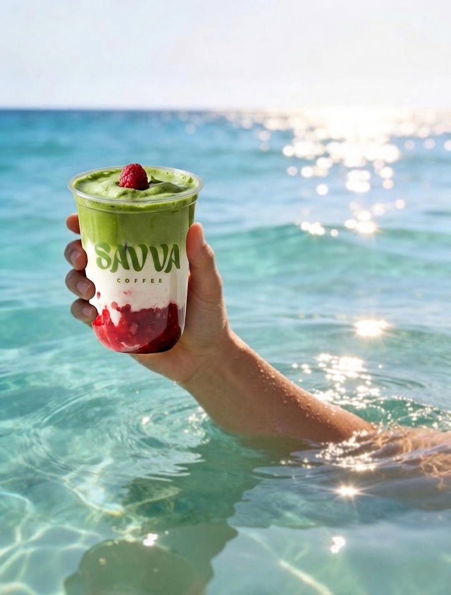 Off-brand (swimming pool)</td>
<td></td>
</tr>
</table>

## Adding or swapping a photo

1. Download the new source: `curl -sL -A "Mozilla/5.0" -o assets/raw/ig_<code>.jpg "https://www.instagram.com/p/<code>/media/?size=l"`.
2. Add or edit its entry in the `SLOTS` dict in `scripts/optimize-images.py` (slug, shortcode, aspect ratio, optional manual crop box).
3. Run `python scripts/optimize-images.py`.
4. Update the thumbnail and table rows above so the index stays accurate.
